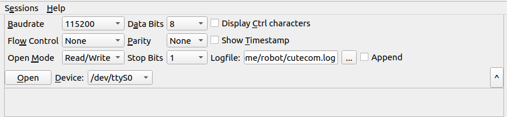

OS： ubuntu22.04

# 串口调试工具

由于笔者的操作系统是ubuntu22.04，所以日常调试串口是通过cutecom进行的

### 下载cutecom

```sh
sudo apt update
sudo apt install cutecom
```

### 怎么在cutecom查看数据



> 由于USB串口是一个IO资源，那么只能一个对象拥有，在cutecom运行期间，如果你的串口程序也在运行
> ，且cuteCom和程序所使用的串口是同一个，那么就会出现争抢USB串口资源现象，一般是cutecom会持
> 有资源.